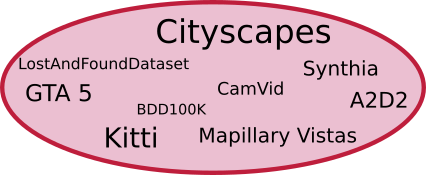

 <br/>

# Dataloader

## About 
This is the dataloader mainly developed by [Marvin Klingner](https://www.tu-braunschweig.de/en/ifn/institute/team/sv/klingner) and Marcel Mross at the Institute for Communications Technology. It currently supports the loading of images, depth maps, segmentation masks and (experimental) optical flow maps. Furthermore the data can be loaded as single images, stereo image pairs or image sequences of arbitrary user-defined lengths. Additionally, various augmentations are pre-implemented.

## Support
Currently among others, the following datasets are supported:  
- Cityscapes
- KITTI
- BDD100k
- Mapillary
- SYNTHIA
- Virtual KITTI
- Gta5
- Camvid

## Requirements
We always intend to support the newest PyTorch release, as this code is actively used throughout various projects at the Institute for Communications Technology. At the moment our code is tested with.

```
pytorch>=1.1
matplotlib
opencv>=4.4.0
pandas>=1.1.1
scipy>=1.5.2
numpy>=1.18.1
```

## Installation
1. 'cd' into the dataloader directory
2. Execute `pip install . -e` in your environment
3. Use e.g. `from dataloader.pt_data_loader.specialdatasets import StandardDataset` in your code

## Environment Variables 
The dataloader is working with environment variables to guarantee a better portability between different systems (especially between Windows and Linux). For this reason you need export the following environment variables before starting your scripts/jobs, if they utilize our dataloader:

##### Linux
```
export IFN_DIR_DATASET=/path/to/datasets/
export IFN_DIR_CHECKPOINT=/path/to/Checkpoints
```
You may also add this to your .bashrc, if you want to store these variables permanently. 

##### Windows
```
setx IFN_DIR_DATASET /path/to/datasets/
setx IFN_DIR_CHECKPOINT /path/to/Checkpoints
```


## Dataset Preparation
Our dataloader is using a ```.json``` files to determine the dependencies of files and annotations from different directories. 
To create them for a specific dataset please refer to `file_io/README.md`.
Additionally an example is shown in ```example/cityscapes_preparation_example.py```. 

The json should be placed in the root folder of the dataset. The structure should look like this:

        <Datasets>
          <cityscapes>
            basic_files.json
            parameters.json
            test.json
            train.json
            validation.json            
            <camera>
              <...>
            <leftImg8bit>
              <...>
            ...
            <vehicle>
              <...>
          <kitti>
            basic_files.json
            parameters.json
            
            <Depth>
              <...>
            ...
            <Segmentation_unsupervised>
              <...>
          ...
          
#### KITTI
For KITTI a download script can be found in `data_preprocessing/KITTI/download_kitti.py`. The necessary directory structure
is automatically created.
```python3 download_kitti.py```
          


## Using the Dataloader
For using the dataset simply create a ```StandardDataset``` object, which you can import from the ```dataloader/pt_data_loader/basedataset.py``` file.
It is loadable with the custom ```DataLoader``` class supplied by PyTorch. 
Exemplary job scripts are supplied in the ```example``` directory, in particular for Cityscapes an example is shown in ```example/cityskapes_dataloader_example```

## Dataset .json download

We supply some pre-created json files, however you should be able to create them yourself using the scripts supplied in the ```dataloader/pt_data_loader/file_io``` folder.

-Kitti:                     https://drive.google.com/drive/folders/1Qmb31xqcLAR9DgicN9Lo5GNxXujuyK5N?usp=sharing

-Kitti eigen split:         https://drive.google.com/drive/folders/1dnYSNYLrvB4K5Hu7A4qXsd1K9gN6FDYu?usp=sharing

-Kitti zhou split:          https://drive.google.com/drive/folders/1sLJQM3VZWFG44lHbPaTnr6EVu3d3ksMX?usp=sharing

-Kitti zhou split left:     https://drive.google.com/drive/folders/1fgNXAahOZapjQmJy-hMY8nGBwJw3lBbi?usp=sharing

-Kitti zhou split right:    https://drive.google.com/drive/folders/1FeELyyH7o7mgbPnBO4V5IrE5xC6QVq_-?usp=sharing

-Kitti benchmark split:     https://drive.google.com/drive/folders/1WamSihx64tjrjHqMDAD8N2eHxnefi6K5?usp=sharing

-Cityscapes:                https://drive.google.com/drive/folders/1Ky66UBRtMCBgu2qp6Nchd9psZkDgeuyT?usp=sharing

-Gta5:                      https://drive.google.com/drive/folders/10dYTpFhg3hYFrTPaD2StCyYeffDus2qq?usp=sharing

  

## Simple Mode
If your dataset is not (yet) supported you can either choose the simple mode or implement the dataset yourself <i>(refer to the next section)</i>
For using the simple mode instead of using the `StandardDataset` class, use the `SimpleDataset` class and set `simple_mode=True`
```
dataset = SimpleDataset(dataset=dataset, trainvaltest_split='train',
                      simple_mode=True,
                      keys_to_load=['color', 'segmentation'],
                      data_transforms=data_transforms
                      )
```
Folders should have the same name as keys. Folder structure is assumed to be as follows:

        <path>
          color
            <image_01>
            ...
            <image_n>
          segmentation
            <image_01>
            ...
            <image_n>
          ...
          
Additionally there needs to be a `parameters.json` file:

```
{"K": null, "stereo_T": null, "labels": "None", "labels_mode": "fromid", "depth_mode": null, "flow_mode": null, "splits": null}
```
The following parameters need to be defined:

        - K: Extrinsic camera matrix as a Numpy array. If not available, take None
        - stereo_T: Distance between the two cameras (see e.g. http://www.cvlibs.net/datasets/kitti/setup.php, 0.54m)
        - labels:
        - labels_mode: 'fromid' or 'fromrgb', depending on which format the segmentation images have
        - depth_mode: 'uint_16' or 'uint_16_subtract_one' depending on which format the depth images have
        - flow_mode: specifies how the flow images are stored, e.g. 'kitti'
        - splits: List of splits that are available for this dataset


As of the others, an example script can be found in the `example` dir.

## Create Dataset Support
For creating support for your dataset please refer to `dataloader/file_io/README.md`
- (optional) open a pull request. Maybe other people want to use the same dataset as you. Thank you in advance!

## License

This project is licensed under the MIT License. 
